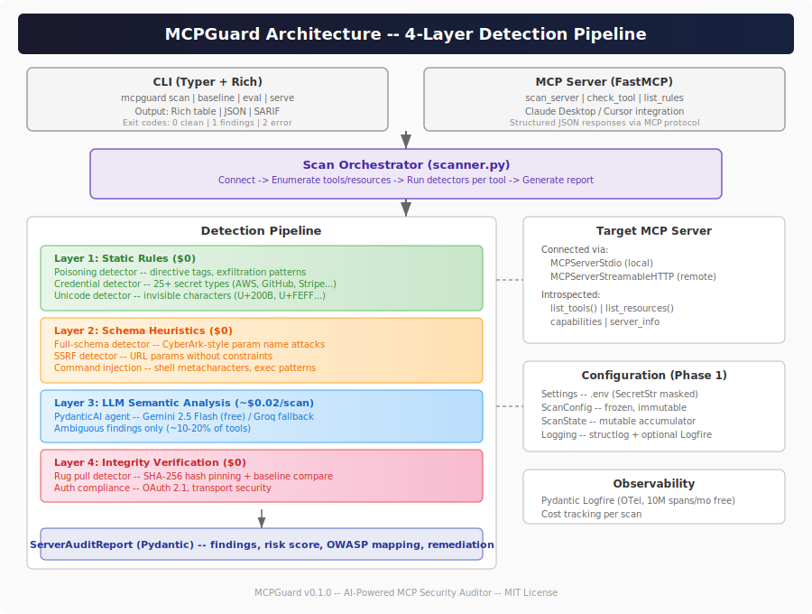

# MCPGuard

AI-powered security scanner for MCP servers. Connects to any MCP server, performs comprehensive vulnerability scanning via a 4-layer detection pipeline, and produces structured reports.

Ships as both a CLI tool (`pip install mcpguard`) and an MCP server (usable from Claude Desktop, Cursor).

## Architecture

<p align="center">
  
</p>

> Editable source: [docs/architecture.drawio](docs/architecture.drawio) (open with [draw.io](https://app.diagrams.net))

### Detection Pipeline

| Layer | Method | Cost | Detectors |
|-------|--------|------|-----------|
| 1 | Static Rules | $0 | Tool poisoning, credential exposure, unicode steganography |
| 2 | Schema Heuristics | $0 | Full-schema poisoning (CyberArk-style), SSRF params, command injection |
| 3 | LLM Semantic Analysis | ~$0.02/scan | PydanticAI agent (Gemini 2.5 Flash / Groq fallback) -- ambiguous findings only |
| 4 | Integrity Verification | $0 | SHA-256 hash pinning, rug pull detection, OAuth 2.1 compliance |

80%+ of detections are zero-cost rule-based. LLM is invoked surgically for the ~10-20% of tools with ambiguous descriptions.

## Installation

```bash
pip install mcpguard
```

Or with [uv](https://docs.astral.sh/uv/):

```bash
uvx mcpguard scan .
```

### Development Setup

```bash
git clone https://github.com/nishantgaurav23/mcpguard.git
cd mcpguard
make venv          # Create .venv (requires uv)
make install-dev   # Install runtime + dev dependencies
make check         # Lint + type-check + test
```

## Usage

### CLI

```bash
# Scan MCP servers defined in a config file
mcpguard scan /path/to/claude_desktop_config.json

# Scan a specific server URL
mcpguard scan --url http://localhost:8080

# Scan with options
mcpguard scan --severity high --no-llm /path/to/config.json

# Output formats
mcpguard scan --format json .
mcpguard scan --format sarif .     # GitHub Code Scanning compatible

# Manage hash baselines (rug pull detection)
mcpguard baseline create /path/to/config.json
mcpguard baseline check /path/to/config.json
```

### MCP Server Mode

MCPGuard itself runs as an MCP server for IDE integration:

```bash
mcpguard serve
```

Claude Desktop / Cursor config:

```json
{
  "mcpServers": {
    "mcpguard": {
      "command": "uvx",
      "args": ["mcpguard", "serve"]
    }
  }
}
```

## Tech Stack

| Layer | Technology |
|-------|------------|
| Language | Python 3.10+ |
| Agent Framework | PydanticAI v1.70+ |
| MCP Server | FastMCP (via PydanticAI) |
| CLI | Typer + Rich |
| LLM (primary) | Gemini 2.5 Flash (free: 1,000 RPD) |
| LLM (fallback) | Groq Llama 3.3 70B (free: 14,400 RPD) |
| Evaluation | pydantic-evals |
| Observability | Pydantic Logfire (OTel) |
| Testing | pytest + pytest-asyncio |
| Linting | ruff |
| Type Checking | mypy (strict) |
| Packaging | Hatchling + PyPI Trusted Publishers |

## Project Structure

```
mcpguard/
├── src/mcpguard/
│   ├── __init__.py              # Package init (__version__)
│   ├── __main__.py              # python -m mcpguard support
│   ├── cli.py                   # Typer CLI entry point
│   ├── scanner.py               # Scan orchestration
│   ├── mcp_server.py            # FastMCP server mode
│   ├── agents/                  # PydanticAI agents
│   │   ├── semantic_agent.py    # LLM semantic analyzer
│   │   └── report_agent.py      # Report generator
│   ├── detectors/               # Detection pipeline
│   │   ├── base.py              # BaseDetector ABC + registry
│   │   ├── poisoning.py         # Tool description poisoning
│   │   ├── credentials.py       # Secret pattern matching
│   │   ├── unicode.py           # Invisible character detection
│   │   ├── full_schema.py       # CyberArk-style schema poisoning
│   │   ├── ssrf.py              # URL parameter analysis
│   │   ├── command_injection.py # Shell metacharacter detection
│   │   ├── rug_pull.py          # Hash-based tool pinning
│   │   ├── auth.py              # OAuth 2.1 compliance
│   │   ├── transport.py         # TLS/transport analysis
│   │   └── shadowing.py         # Cross-server analysis
│   ├── models/                  # Pydantic data models
│   │   ├── config.py            # Settings, ScanConfig, ScanState
│   │   ├── findings.py          # VulnerabilityFinding, ServerAuditReport
│   │   └── semantic.py          # SemanticAnalysis model
│   ├── formatters/              # Output formatters
│   │   ├── rich_output.py       # Rich terminal rendering
│   │   ├── json_output.py       # JSON formatter
│   │   └── sarif.py             # SARIF 2.1.0 generator
│   ├── rules/                   # Detection rules
│   │   ├── patterns.py          # Regex patterns
│   │   ├── owasp_mapping.py     # OWASP MCP Top 10 mapping
│   │   └── cvss.py              # Risk scoring
│   └── utils/
│       ├── logging.py           # Structured logging + Logfire
│       ├── hashing.py           # SHA-256 tool hashing
│       └── config_loader.py     # MCP config file parsing
├── evaluation/                  # Self-evaluation benchmark
│   ├── benchmark.yaml           # 50+ labeled test cases
│   ├── fixtures/                # Vulnerable test servers
│   └── run_eval.py              # Benchmark runner
├── tests/                       # Test suite
├── specs/                       # Spec-driven development docs
├── docs/
│   ├── architecture.svg         # Architecture diagram
│   └── architecture.drawio      # Editable source (draw.io)
├── pyproject.toml               # Dependencies + tool config
├── Makefile                     # Developer commands
└── .env.example                 # Required environment variables
```

## OWASP MCP Top 10 Coverage

| ID | Category | MCPGuard Detection |
|----|----------|--------------------|
| MCP-01 | Tool Poisoning | Regex + LLM semantic analysis |
| MCP-02 | Excessive Permissions | Schema parameter analysis |
| MCP-03 | Insecure Data Handling | Credential/secret scanning |
| MCP-04 | Lack of Tool Safety | Command injection detection |
| MCP-05 | Insufficient Logging | Transport/config analysis |
| MCP-06 | Insecure Communication | TLS/transport verification |
| MCP-07 | Missing Authentication | OAuth 2.1 compliance checks |
| MCP-08 | Rug Pull / Tool Mutation | SHA-256 hash pinning |
| MCP-09 | Cross-Server Shadowing | Multi-server description analysis |
| MCP-10 | Unicode Steganography | Invisible character detection |

## Development

### Commands

```bash
make venv          # Create virtual environment
make install       # Install runtime deps
make install-dev   # Install runtime + dev deps
make check         # Run lint + typecheck + test
make test          # Run pytest with coverage
make lint          # Run ruff check + format check
make typecheck     # Run mypy strict
make format        # Auto-format code
```

### Testing

```bash
# Run all tests
make test

# Run specific test file
python -m pytest tests/test_s1_3_config.py -v

# Run with coverage report
python -m pytest tests/ --cov=mcpguard --cov-report=html
```

### Environment Variables

Copy `.env.example` to `.env` and configure:

```bash
GEMINI_API_KEY=     # Gemini 2.5 Flash (required when enable_llm=True)
GROQ_API_KEY=       # Groq Llama 3.3 70B (fallback)
LOGFIRE_TOKEN=      # Pydantic Logfire (optional, degrades gracefully)
LOG_LEVEL=INFO      # DEBUG | INFO | WARNING | ERROR
```

## License

MIT
